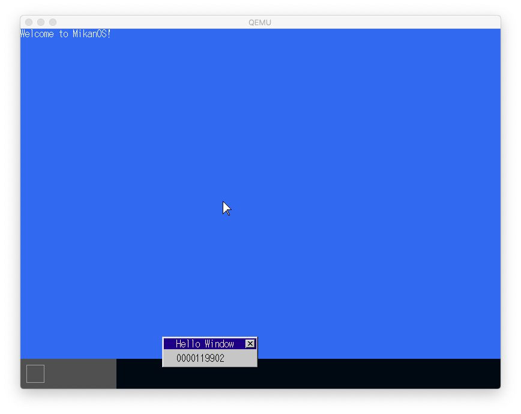

# [読書] ゼロからのOS自作入門
`#ゼロからのOS自作入門` `#みかん本`

## :closed_book: 読んだ本
|||
|:--|:-:|
|[ゼロからのOS自作入門 内田公太 [著]](https://zero.osdev.jp/)| |

* この本の0〜10章を読んだ理解と感想をまとめ。
* 長編本なので、3部(前・中・後)にわけて感想をまとめることにした。これは、このうちの前編の感想記事

## :muscle: モチベーション
* 前職の業務でサポートエンジニアっぽい仕事していたことがあり、深いところのデバッグを要求されると、どうしてもOSのことを理解していないと対処できないことが多かった。
* そのとき苦労しながらいろいろ調べて対処していたが、ずっと「改めてきちんとOSについて理解をしておきたい」と思っていた。
* 現職の割と上位レイヤーな開発でもすこしでも、低レイヤーなことは理解していて良かったと思うことが多くあるし、業務的にもIoT機器との通信処理などでドライバー開発をする可能性もあるため、この際ちゃんと理解を深めておきたいと思った。
* 2021年は、TLにこの本のたくさん高評価な話題があがっていて、タイムリーだった。

## :clock1: かかった時間など
* 期間： 2021/8/18 〜 2021/12/2
* 読書時間： 75 時間くらい

## :computer: 開発環境、進め方など
* Intel mac に Homebrewでqemuを入れて開発
* ビルド・ブートイメージの作成は、ubuntuのDockerコンテナをつくって [uchan-nos/mikanos-build](https://github.com/uchan-nos/mikanos-build) から構築
* 醍醐味ともいえるブート用の物理x86_64マシンは用意できず、結局ずっとMacのqemuでのみ起動して進めている:sweat_smile:
* 写経用のリポジトリとして [uchan-nos/mikanos](https://github.com/uchan-nos/mikanos) からForkしたリポジトリ [ngwork0301/mikanos](https://github.com/ngwork0301/mikanos) を作成
* Forkしたリポジトリを`osbook_day02a`タグまで戻して、書籍と作者のコミット修正を見ながら写経してリポジトリにPushしながらすすめる
* 各節での区切りのいいところで作者がタグを打ってくれているので、それにならって同様にタグ`dayNNx` (NNは章番号、xは区切りのいいところでのアルファベットの通番) を打ちながら進めた
* ただ写経するだけでなく、ソースをみて理解した処理内容をコメント文として追記。いちおうDoxgenのコメント規約をベースにしているが、実際に出力はしていない。
* プライベートリポジトリに、各章の理解メモを入れながら

!!! Note
    スタディしたメモ等を残したリポジトリは、書籍側の著作権を考慮して非公開(プライベートリポジトリ)にしています

## :curry: ここまででできたもの

* ソースは、Tag: [day10g](https://github.com/ngwork0301/mikanos/releases/tag/day10g)

* 10章までやると、以下ができる
  * UEFIブートローダー(C)でカーネル(C++)が起動できる
  * 画面が表示でき、printkでカーネルのコンソール出力ができる。
  * メモリ管理(ここでは論理アドレス＝物理アドレス=リニアアドレス)ができる
  * ウィンドウを1つつくってLocal APICタイマー処理が描画できる。
  * デスクトップに描画するウィンドウをレイヤー管理して重ね合わせが処理できる。
  * IDTによるマウスイベント処理ができ、マウスイベントでウィンドウの移動ができる。

## :tada: 感想
* ひたすら楽しい。
  * 根本的なものからつくれるというのは、上位アプリケーションをつくるのとはちがった楽しさ
* ステップを踏んで1節1節、リズミカルにコーディングを進められる。
  * **1ステップができるだけシンプルになるようにかなり工夫されていて**、OSという巨大な魔物をかなりこまかな粒度で少しずつ進められる。
  * １ステップ内でのハマりポイントがすくないのが助かる
* 動作環境周りで苦戦するかとおもったが、意外とスムースにいった。
  * QEMUでできるので、実機がなくてもよい。
  * ブートローダもちゃんとつくるので、カーネルイメージのロード方法とか意識しなくていい。本当に教材なしで自分でやり始めるとこの辺でハマって実際のOS作りにいけない気がする。
  * ubuntuコンテナさえつくれば、Ansibleで簡単にビルド環境つくれた。構築のためのReadmeも充実している。
* 「5.3 フォントを増やそう」でちょっと急に反則感があったw。hankaku.txtをどうやってつくったか、makefont.pyでやっていることの説明はなかったので、ソースを覗いて調べた。functools + ラムダ式で実にスマートに書かれていた。なぜかpythonの勉強にもなったw
  * このあとUSBドライバーの実装で筆者が用意したものをつかうなどもある。すべてをゼロからつくることに意義があるわけではないので、ちゃんと本質的な理解を先にやるには、たしかにこのほうが良い。
* sprintfを使えるようにするときに組み込みでも使いやすい最低限でつかえるCライブラリのNewlibをつかった。**これは自分ひとりでは切り開けない。**何かを切り開いて実装していくときに、デファクトスタンダードなやり方がわからないことは怖いことだと改めて思った。
  * 新しい技術や言語を使うことに挑戦する人の凄さを改めて感じた。
  * そして、そういうときに、エンジニア同士のつながりが持てていて、わからないことを恥ずかしくなくきけることがとても重要なのだろうと思った。
* 知らない最新のC++/Makefileの書き方を知った。clang++の`#pragma once`やstatic_castなど知らなかった。(6.4 節コラム)
  * もはやg++よりclang++のほうがデファクトなのか(？)というのも知らなかった。
  * もはやC++は、自分の第一言語ではないのかもしれない...。
* USB マウス(xHCI)の対応で筆者の苦労のあとがあり、書籍にもかかれてあって面白い。（参考：[MikanOSの歴史](https://uchan.hateblo.jp/entry/2019/12/02/210854)）
* OSは恐れなくていい。※恐れるべきはABIとコンパイラ。
  * コンパイラがカーネルをコンパイルするときにいろいろやっているのでできちゃう。（謎は包まれたまま...。疑問点は後述）
  * ABIを参照して、必要に応じてコンパイラに任せずアセンブリを自前で実装する必要があるのでこれをちゃんと学んでおく必要がある。
  * UEFIの機能や、ABIでCPUが提供する機能が多く、あまりに簡単に開発ができてしまうので、**「OSは、ただのラッパーでシステムコールとしてのインタフェースを提供するだけのものか」と一瞬思ったが、後から、「つかいやすく高速に動かすためのあらゆる工夫が提供されているもの」ではないか**という感覚になった。
  * ただしこのあとの11章以降で恐れることになる可能性がまだある(笑)。

## :smile: 理解したこと
* ブートローダーのデファクトスタンダードであるUEFIは、PE形式(Windowsアプリ互換)でEDK IIで開発できる。
  * 起動時に表示される「tianocore」は、EDKⅡをオープンソースコミュニティの名称
  * EDKⅡのリポジトリは、[tianocore/edk2](https://github.com/tianocore/edk2)
* ブートローダーからのOSブートは単純にC言語のバイナリのシンボルからエントリポイントをみつけてC言語関数としてキャストして呼ぶだけだった。意外と単純！
* PCIデバイスの探索は、CPUがCONFIG_ADDRESSレジスタとCONFIG_DATAレジスタにPCIコンフィギュレーション空間の情報を入れてくれるので、それを足がかりに探す。
* マウスのイベント処理は、CPUの割り込み処理を使う
  * CPUの仕様によってメインメモリのきまったアドレスに展開されているIDT（割り込み記述子テーブル Interrupt descriptor table)に、割り込みハンドラを登録して、割り込みを発生させる。
  * マウスはxHCIで、PCI規格にあるMSI(Message Signaled Interrupts)によって割り込み発生させる。
* メモリは、UEFIから渡してもらった領域をカーネル側で再度スキャンして独自管理する。
  * スタック領域：UEFIからカーネルに移ってきた直後はUEFIのスタック領域を使ってしまうのでちゃんとした場所を確保し直し
  * GDT(Global Descriptor Table)：セグメンテーションの設定を集めたもの。
  * ページテーブル：メモリを固定長の区画に分割して管理。今回はアイデンティティマッピング（リニアアドレスと物理アドレスを一致させておく）
* メモリ管理を実装したら、mallocでつかわれるsbrkをシステムコールを実装すれば、C++ のnew演算子がつかえるようになる。
* ウィンドウの重なりはLayerManagerで実装。重なったウィンドウはひとつひとつ順番に単純にやると再描画に時間がかかるので、必要が領域に絞って再描画するように性能改善して実装。これは、現代の進化したPCでも結構遅くなるし、ユーザ体験が悪くなるので必要な実装

## :joy: ハマったところ
### 4.3節 osbook_day04cでリンクエラーになる
* [issue #1: undefined symbol: __cxa_pure_virtualでリンクエラーになる](https://github.com/ngwork0301/mikanos/issues/1)
  * 上記issueにも書いたとおり、本家のコミット修正 Commit: [2a43487](https://github.com/ngwork0301/mikanos/commit/2a4348790a0d313bb52b674f258122f1d4f2511e) でも同様に__cxa_pure_virtual関数の実装が入れられている。
  * なぜか自分の環境では早い段階でこの問題が発生した様子。
  * 構築したビルド環境のclang++のバージョンに違いがあった？？
  * いつもだけどコンパイルエラーよりもリンクエラーの解決は、ハマりやすい。やはりコンパイラとリンカの仕組みもちゃんと理解しておくとよいのだろう。低レイヤーは沼。

### 10.4節 マウスの再描画に失敗して残像が映る
* LayerManager::Drawメソッドに、Log関数でデバッグ出力して、Layer IDやサイズやポジションをみてみた。問題なさそう。コンソールと重なっている部分はうまく描画でき、コンソールの範囲外になると残像が映る。
* 結局、写経をミスって**operator演算子「&」をつかった「描画範囲同士の重なった部分を算出する処理」がバグっていた**。
* Window::DrawToメソッドにデバッグ出力をいれると、起動に失敗する。コンソールの初期化中でも使われていて、別な不具合がおきてしまったのかもしれないと思ったが、これは以下のバグによるものだった？
* Layer::DrawToメソッドへのデバッグ出力でも、起動に失敗する。処理にバグがあり、メモリ破壊しているのかもしれない。
* バグの可能性がある処理の範囲が狭まったので見直して、operator演算子&で描画範囲同士で重なった部分を算出する処理にバグがあったことを発見。
* この辺スマートに実装されていたのだが、いろいろちゃんと理解しないで写経していたことを認識。調査によりちゃんと理解できてよかった。

## :question: さらなる疑問点、勉強したいこと
* コンパイラ、リンカへの理解を深めたい。
  * カーネルをフリースタンディングでコンパイルしたときとそうでないときに、バイナリレベルではどういう違いがあるか？システムコールなどがつかえるかどうかか？
  * カーネルのリンク時にリンクしているファイルの中身はどういうものか？コンパイラが用意してくれるもののたくさんの謎がある。
  * 5.3 でhankaku.oの変数をexternで読み取っているが、詳細はどういうことか
  * [@rui314](https://twitter.com/rui314) さんの書かれた[低レイヤを知りたい人のためのCコンパイラ作成入門](https://www.sigbus.info/compilerbook) とかやって理解を深めてみたい。
* UEFIの機能すごい。BIOS時代は大変だったのだろうと思うけど、歴史的なものも今度調べてみたいとは思う(思わない)。もはやEDK2上でUEFIとしてOSをつくればよいのでは、という感覚にもなる。そういう場合もあるのだろうか。
  * [自作OSアドベントカレンダー2021](https://adventar.org/calendars/6581)で[UEFIのCUIベースのOSを作ってる話](https://qiita.com/ThinkpadL540/items/42edb86e815f571832b0)というのがあった。
  * （というか自作OSアドベントカレンダー2021、みんな楽しそう。）

## :telescope: 今後の展望
* 次回11章〜21章は、以下のような「まさにOSの真髄部分」の実装が待っている。このペースでさらっと進む様子だけど、どうやって進んでいくのか楽しみ
  * マルチタスク
  * ターミナル
  * コマンド
  * ファイルシステム
  * ページング
  * システムコール
* Intel Macで開発していたけど、M1 Macへ移行する。ビルド用のコンテナも、カーネルイメージもこのままQEMUで動くはずだけど変なことにならないことを祈る。

