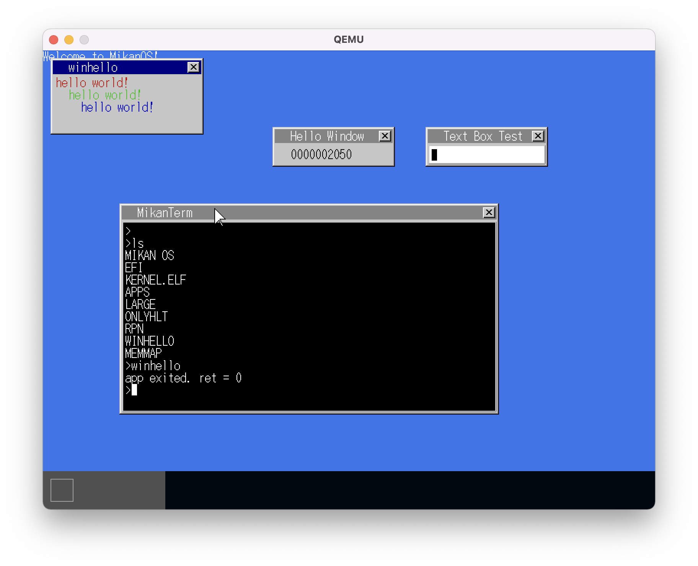

# [読書] ゼロからのOS自作入門(中編)
`#ゼロからのOS自作入門` `#みかん本`

## :closed_book: 読んだ本
|||
|:--|:-:|
|[ゼロからのOS自作入門 内田公太 [著]](https://zero.osdev.jp/)| |

* この本の11〜21章を読んだ理解と感想をまとめ。
* 長編本なので、3部(前・中・後)にわけて感想をまとめることにした。これは、このうちの中編の感想記事
  * 前編の記事は [こちら](../../2021/zero-osdev-0_10/index.html)

## :clock1: かかった時間など
* 期間： 2021/12/3 〜 2022/3/3
* 読書時間： 62 時間くらい

## :computer: 開発環境、進め方など
* M1 mac に Homebrewでqemuを入れて開発
* 前編までは Intel Macでやっていた。
* M1への移行は、簡単につまづく事なくできてしまった。
  * ビルド用のubuntuコンテナ(x86)もそのままM1に移行でき、`qemu-system-x86_64` コマンドでx86として実行できる。
* (前回同様)写経用のリポジトリとして [uchan-nos/mikanos](https://github.com/uchan-nos/mikanos) からForkしたリポジトリ [ngwork0301/mikanos](https://github.com/ngwork0301/mikanos) にPushしながら
* 各節での区切りのいいところで作者にならって同様にタグ`dayNNx` (NNは章番号、xは区切りのいいところでのアルファベットの通番) を打ちながら。
* ただ写経するだけでなく、ソースをみて理解した処理内容をコメント文として追記
* プライベートリポジトリに、各章の理解メモを入れながら

## :curry: ここまででできたもの

* ソースは、Tag: [day21f](https://github.com/ngwork0301/mikanos/releases/tag/day21f)

* 21章までやると、以下ができる
  * ACPI PMタイマーにより、より正確な時間でのタイマー処理ができる
  * テキストボックスを立ち上げて、キーボードによる入力ができる
  * コンテキストスイッチにより、複数のタスクを並行して実行することができる。
  * ターミナルを立ち上げて、コマンドを実行することができる。
  * FAT32形式のファイルシステムをロードすることができる。
  * アプリケーションをFAT32ディスクイメージからロードして実行できる。
  * アプリケーションのためのメモリ管理ができる
    * ページングの設定でリンカにより指定されたアプリケーションが認識する仮想メモリと、物理メモリの割当をアドレス変換表でマッピング
    * セグメンテーションをつかって、アプリケーションとOSを区別したメモリ管理ができる
  * 逆ポーランド記法での算術をするアプリケーションが実行できる。
  * TSSレジスタを設定して、アプリケーション実行中のコンテキストスイッチでのスタック領域の切り替えに対応
  * CPU例外をハンドリングして、エラー内容を画面上に表示できる。
  * アプリケーション側が使用できるシステムコールとして以下が使用できる
    * printf → PutString ターミナルに文字列を出力
    * exit → Exit アプリケーションの終了
    * OpenWindow：ウィンドウを開く

## :smile: 理解したこと
* ACPI PM(Power Management)タイマーをつかって、電源の周波数をベースにして(これも可能なかぎりだが)正確な時間を測っている
  * メモリアドレス空間FADT(Fixed ACPI Description Table)にACPI PMのIOポート番号がはいっている
  * RSDT → XSDT → FADT → レジスタIOポート番号 → ACPI PMのレジスタの中身で取り出す
  * RSDT (Root System Description Table) はUEFIが知っているので、ブートローダから得る。
* 今回MikanOSではマルチタスクは、並行処理（シングルスレッドを細かく一定時間ずつ素早く切り替えて複数動いているように見える）で実現する。
  * コンテキストスイッチ：そのタスクを実行するときのレジスタの値を全部そっくり移し替えてスイッチさせる。
  * (C++ではできないので)アセンブラで各レジスタの値をそのタスク用に用意したスタック領域に退避／復旧して切り替える
  * タイマーハンドラから、人が切り替わりを感じないくらい短い周期でコンテキストスイッチさせることでマルチタスクが実現。
  * ランレベルによってタスクの優先度をつけて実行
  * タスクに状態遷移をつける。アイドルタスクに対応
* セグメンテーション
  * メモリ領域をセグメント(区域)に分けて、管理する。
  * OS用、アプリ用のそれぞれのコードセグメント、データセグメントとして分けてつかう。
* ページング
  * 仮想メモリ空間を4階層で管理して物理メモリ空間にマッピングしている。
  * 仮想メモリ領域には、制約があり、ビット63:47が全て0か全て1でなければならない（この制約を満たしたアドレスをカノニカルアドレス）。
  * MikanOSでは、カノニカルアドレスの前半(0x0000000000000000〜0x00007fffffffffff)をOS用、後半(0xffff800000000000〜0xffffffffffffffff)をアプリ用にした。一般的には、逆のほうが多い。
* TSS
  * CPLが小さいコードセグメントへ切り替えが行われたときに、TRレジスタの値に設定されているTSS(task-state segment)を参照してスタック領域が設定される
  * RestoreContext関数のアセンプリ実装でコンテキストの復旧をする
* CPU例外
  * タイマーやマウスイベントなどと同様にIDTでハンドル実装をエントリすることで例外をつかめる。
* システムコール
  * CPUのsyscall命令をつかうことでring=3側から安全にOSの機能を呼び出せる
  * アプリ側とOS側で決めたsyscall_tableの定義をみて呼び出す。
  * newlib_support.cで定義する関数も、MikanOSカーネルが提供するsyscall_tableの関数をつかって実装すれば、つかえるようになる。

## :joy: ハマったところ
### 20.2節 OSを守ろう(1)でのエラー
* [issue #3: rpnコマンドを実行すると、CallApp関数でOSがダウンする](https://github.com/ngwork0301/mikanos/issues/3)
* もやもやしながら、20.3節まで進んでTSSを実装したら、問題が解決
* 後日、ちゃんとlldbを入れてデバッグしながら調査した。これがめちゃくちゃ時間がかかった。
* M1 Macでのlldbベースのデバッグ方法は、@hideo130さんのQiita記事 [M1 Macでソースコードを見ながら「ゼロからのOS自作入門」のデバッグをする。](https://qiita.com/hideo130/items/ca359c3f656a642cadde) を参考させていただいた。多謝！
* 結局、バグでnewし忘れによりちゃんとしたメモリ領域をつかわず、nullptr=0x00の周辺のメモリを使用していたため、TRレジスタに入っているTSS.RSP0=0x00で使用するメモリ領域と重複してOSダウンしていたのではないかと思われる。

## :tada: 感想
- コンテキストスイッチ：恐るべし！！
  - 13章のコンテキストスイッチは全部アセンブリで書くのはびっくりした。確かにそうするしかないが、、
  - こわいこわいコンテキストスイッチは、切り替え前後でレジスタをみんな入れ替えちゃうだけ。意外にも簡単にできた。ただスタック領域とそのへんに絡むセグメンテーションやページングなどのメモリ管理がバグを生みやすく、調査もしづらい。
- std::find_ifのような途中にラムダ式を入れた書き方が結構使われている。他の言語での使われ方がC++にも波及している？これの書き方がかなりスマートだが、まだまだ自分で実装するときに出てこない気がする。カッコいいコーディングができるための伸びしろがまだまだあるので、スタディ継続しなければ。
- optionalとかスマートポインタ（std::unique_ptrとかstd::find_ifとか）C++14以降追加の機能がまだまだ弱い。なにをincludeすれば使えるようになるのかとか、整理しきれていない。ドヤ顔で使えたらかっこいいだろうなと思う。
- さらっとつくってきたが、かなり複雑になってきた。写経とはいえ、自分ですべてつくってきたものが自分でもすべては把握できない状況になってきている。ここまでつくった機能を前提としてさらに新たな機能を盛り込んでいくのだが、複雑でもちゃんと整理してつくっておかないと機能が積み上げられないと思った。
- すばらしい書籍により簡単に作れているが、OSをつくるには、本来はしっかりと自分が動くCPUのABIを理解する必要がある。アセンブリ欲が高まってきた。基礎的なことくらいは理解したい。
- アプリケーションによってOSが壊されないようにする仕組みは、OSというよりはCPUの機能(セグメンテーション)でやっていた。アセンプリの理解も必要だが、OSだけで完結する機能なのかCPUと密接に関わっている機能なのか把握したい欲が生まれた。その他のハードウェア(TPM、GPU、NIC、RAIDカード...)が持つ機能も、役割がOSとどう関わっているか、などまだまだ深堀りできるものがある。

## :question: さらなる疑問点、勉強したいこと
- いままでその場しのぎでやってきたアセンブリをちゃんとスタディしておく。いろいろな理解がつながっていく楽しさがあるけど、それと同時にたくさんの疑問がわく。
  - 別途、書籍「熱血アセンブラ入門」を購入した。（これは「読み物」として読めるのが楽しいので、読み終わったら別途記事にします）
- リンカの仕組みを紐解く。MikanOSでは、Newlibをつかってシステムコールの呼び出しコードをリンクしている。
  - 余談：リンカといえば、先日[mold](https://github.com/rui314/mold) のリリースがあり、かなり高速化すると話題。

## :telescope: 今後の展望
- 書籍のスマートさにより、最短の時間で(OSが動く仕組みとしては)かなりのことができつつある。後編22〜30章は、MikanOSを、かっこよく、ちゃんと、「ここまでできる」OSという位置づけにしたい筆者の思いがみえる。ファイルシステム、アプリ側のメモリ管理、パイプによるアプリ間連携などはたしかにもう少し深堀りたい感じ。
- 後編、なにより「OS自作本をやり遂げた達成感」味わいたい！

