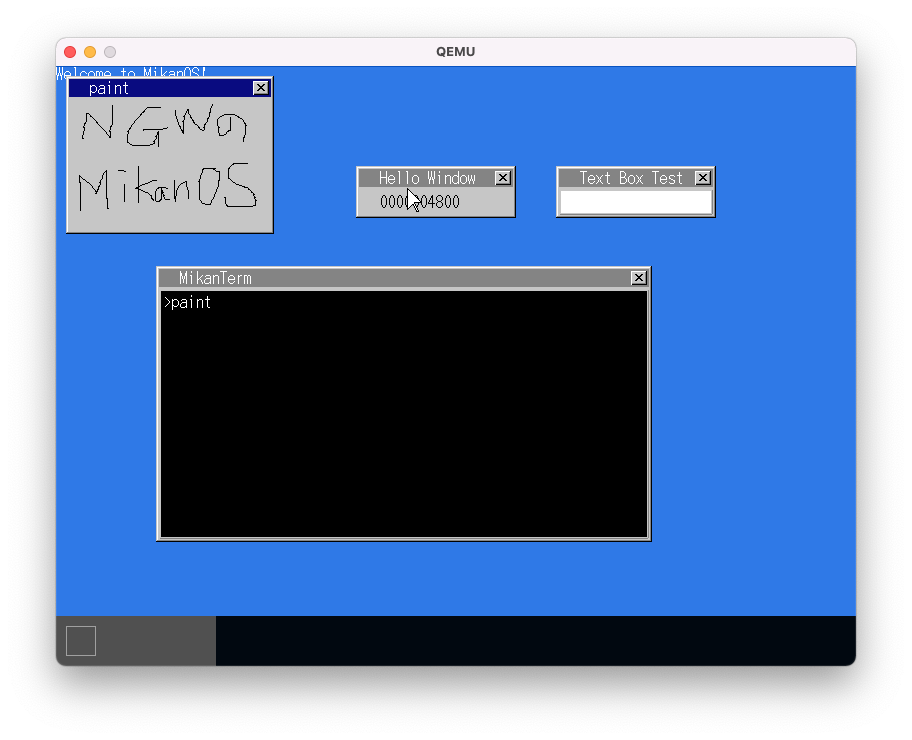
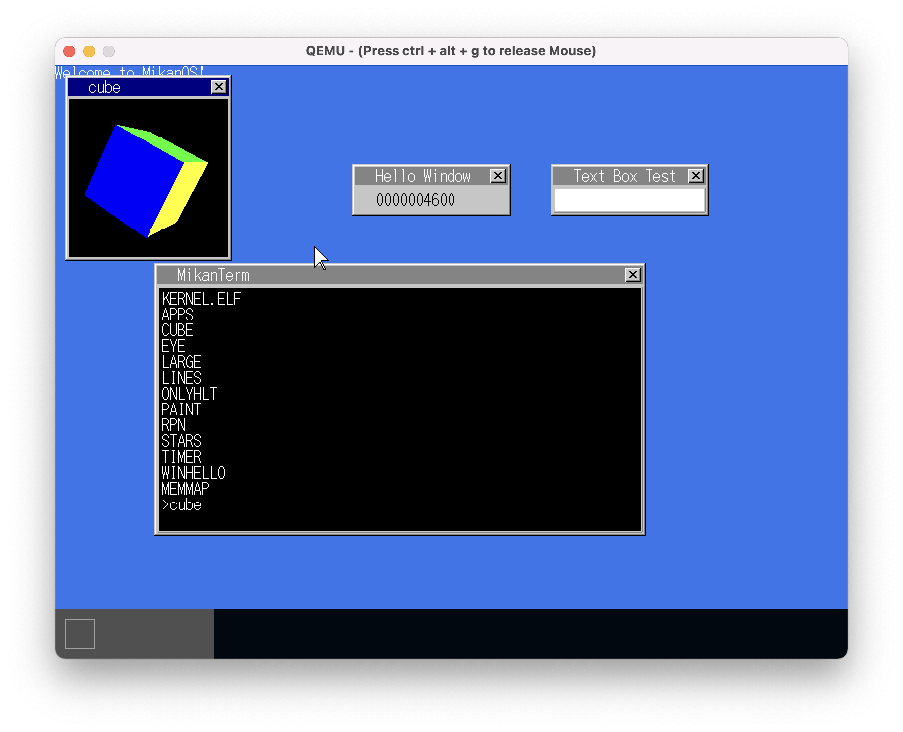
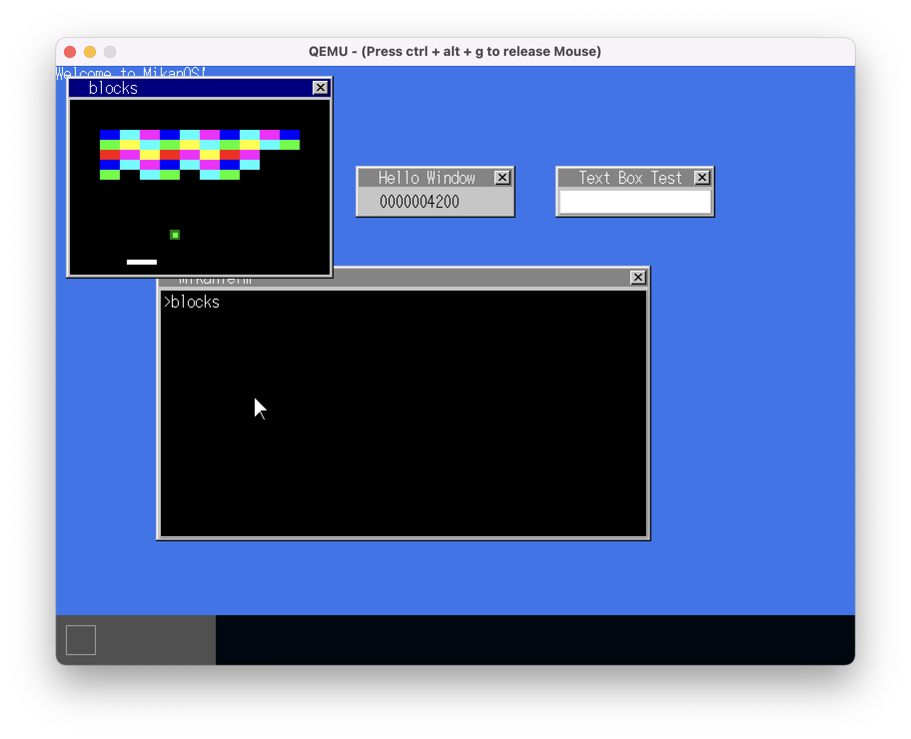
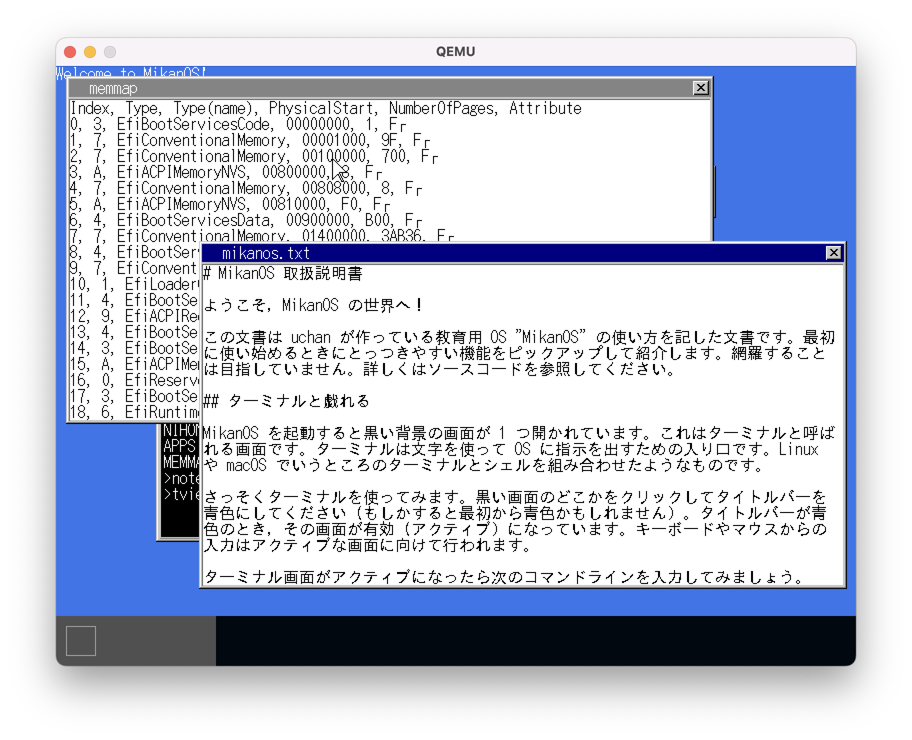
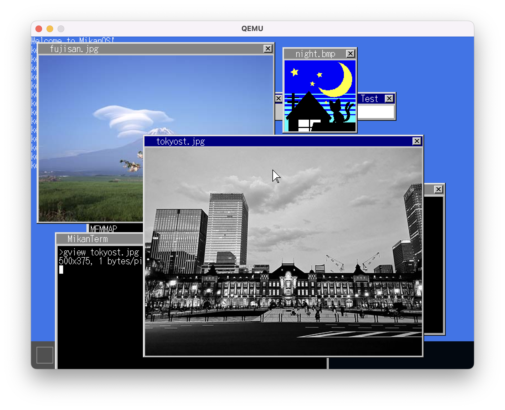

# [読書] ゼロからのOS自作入門(後編)
`#ゼロからのOS自作入門` `#みかん本`

## :closed_book: 読んだ本
|||
|:--|:-:|
|[ゼロからのOS自作入門 内田公太 [著]](https://zero.osdev.jp/)| |

* この本の22〜31章を読んだ理解と感想をまとめ。
* 長編本なので、3部(前・中・後)にわけて感想をまとめることにした。これは、このうちの後編の感想記事
  * [前編の記事](../../2021/zero-osdev-0_10/index.html)
  * [中編の記事](../../2022/zero-osdev-11_21/index.html)
  * 取り組むにいたったモチベーションなども上記参照です。

## :clock1: かかった時間など
* 期間： 2021/03/04 〜 2022/06/15
* 読書時間： 62 時間くらい

## :computer: 開発環境、進め方など
* [中編](../../2022/zero-osdev-11_21/index.html) と同様に、M1 MacにbrewでQEMUをいれて開発。
* 写経用のリポジトリとして [uchan-nos/mikanos](https://github.com/uchan-nos/mikanos) からForkしたリポジトリ [ngwork0301/mikanos](https://github.com/ngwork0301/mikanos) にPushしながら
* 各節での区切りのいいところで作者にならって同様にタグ`dayNNx` (NNは章番号、xは区切りのいいところでのアルファベットの通番) を打ちながら。
* 各章の理解メモは、著作権に抵触しそうなので、プライベートリポジトリに入れながら。

## :curry: 完成したもの
* お絵かきソフトの様子

* アニメーションの様子

* ブロック崩しゲームの様子

* テキストビューアの様子

* 画像ビューアの様子

* 見た目のインパクトが強いので、画像ばかりを並べましたが、後編で以下のことができるようになりました。
* 22章
  * システムコールSyscallWinFillRectangleを実装して、ユーザ領域でウィンドウ描画処理ができるようにした。
  * 描画処理を単純にやると遅いのでタイマー埋めつつ、速度改善。
  * キー入力イベントを受け取れるシステムコールをつくって、ウィンドウを終了できるようにした。
* 23章
  * マウスイベントも受け付けるようにした。
  * マウスイベントを応用して、お絵かきソフトを作成
  * タイマーイベントを受け取れるタスクをメインタスク以外でできるようにした。
  * キューブが自動でぐるぐるまわるアニメーションのアプリを作成
  * USBドライバを改造して、キーボードの入力のイベントを受け付けるように改造
  * キーボードの入力をつかって、ブロック崩しゲームを作成
* 24章
  * 複数のターミナルを表示するにあたり、カーソル点滅イベントのきちんとした振り分けをする。
  * 複数アプリを同時起動するときに、PML4をつかって、同じアプリの仮想アドレスでも物理アドレスを替えることで干渉しないようにする。
  * ターミナル表示なしでアプリを単体実行できるようにする。
  * ring3からring0への書き込みでOSがダウンすることを確認
  * OSダウン時のCPU例外をハンドリングして、アプリだけをダウンして復帰できるように対応
* 25章
  * FATファイルシステムをみて、ディレクトリを参照できるように対応
  * OpenFileシステムコールを実装して、ファイル読み込みができるように対応
  * C++標準のライブラリをつかってパターンマッチングをさせて、grepコマンドを実装
* 26章
  * 標準入力に対応
  * ファイルディスクリプタを抽象化して、FATファイルシステムだけでなく、標準入出力もあつかえるようにした。
  * キーボードイベントを標準入力に対応
  * CreateFileシステムコールを実装してファイル書き込み
  * MikanOSのメモリに展開されているFATファイルシステムには書き込んだものの、これを記憶メディアに書き込む処理はいれていない。
* 27章
  * デマンドページングにより、ページフォルトの例外がおきたときに、新たなページを新たなフレームにマッピング
  * メモリマップトファイルをサポート
  * コピーオンライトをサポート
    * ページフォルトをハンドリングして、アプリ固有の変数は、その必要になったときに物理メモリを確保する？
* 28章
  * ASCII文字以外を??としてあつかえるようにする。
  * 東雲フォントを取り込んで日本語を表示できるようにする。
  * 標準入出力をターミナル以外に接続できるようにすることで、リダレクトに対応
* 29章
  * パイプをサポートして、前のコマンドの出力をつかって次のコマンドを実行できるように対応
  * パイプをつかってsortコマンドを実装
* 30章
  * アプリケーションのパスを通す
  * moreコマンドを作成
  * catコマンドで入力対応して、パイプ接続できるように
  * ウィンドウの閉じるボタンでウィンドウが閉じるように対応
  * テキストビューアを実装
  * 画像ビューアを実装
  * システムコールのインタフェースを追加して、ユーザ領域でさまざまなアプリを作成できるように対応
    * exit()でアプリを終了できるようにする。
    * 塗りつぶしのシステムコールSyscallWinFillRectangleを実装してウィンドウの描画

## :smile: 理解したこと
* システムコール＝POSIX定義の関数だと思っていたけれど、ただのインタフェース=ラッパーになっていて、Syscall〜が実際のシステムコール。
  * 当たり前なのだけれど、別にすべてのシステムコールがPOSIX準拠である必要はないし、コンパイル時のシンボルが解決できさえすれば、上位アプリケーションもPOSIX準拠ではないシステムコールを呼んでも何ら問題はない。ソースコードがMikanOSに固有になるだけ。
  * でもソースがMikanOS固有だからといってコンパイラがMikanOS上にないといけないわけでもない。
* セグメンテーションでOSを守りつつ、さまざまなシステムコール(グラフィック、マウスやキーボードのイベントハンドラ、ファイルシステムへのアクセス)を用意して上位アプリを作れるようにする。
* デマンドページングやコピーオンライトといったメモリの使い方の工夫は複雑だけれど、MikanOSでも実装でき、しくみに触れられる。

## :joy: ハマったところ
### 23.3節 timerコマンドで指定した秒数待たずにイベントが飛んでくる
  * mainの最後のイベントループでターミナルのカーソル点滅用のイベントを送っていたがそれを受信してしまうよう。
  * アプリ側で、おくられてきたkTimerTimeoutメッセージの中身がプラスかマイナスをチェックしていなかった。マイナスがおくられてきた場合のみ、タイムアウトするように変更して対処できた。
  * 調査に時間がかかりすぎたけど、おかげで理解が深まった。理解できていないと、適当に実装されてミスるようで、ハマったときの調査でちゃんと理解できるというのは写経のいいところ？

### 24.5節 ターミナルなしのアプリを実行すると、落ちることがある。
* winhelloアプリを実行したときのTerminal::Print()での出力処理にshow_window_フラグのチェック漏れがあった。
* 出力行がふえて、スクロールしたときもダウンした。Terminal::Scroll1()にもshow_window_フラグのチェックを追加

## :tada: 感想
* まとめ記事をあげるのが遅くなったせいでもうかなりのことを忘れていました:sweat_smile:
  * さっさとおわったら、感想記事を書くべしですね。
* 全体的な総括としてめちゃくちゃ楽しかったです。
  * ステップbyステップ方式、やっぱり良いですね。
  * なにかコードを書いて動かしてみるのは楽しく、それがOSだとなお楽しい。

## :question: さらなる疑問点、勉強したいこと
* 記憶メディアへのドライバ開発
  * MikanOSでは、書き込みもメモリ上にのみ行ったので、記憶メディアへの実際の書き込みはどうやるのか気になる。
* ネットワークドライバ、プロトコルスタック開発
  * 下のレイヤーからプロトコルを実装していくのすごく楽しそう。
* 仮想化技術、コンテナランタイムの調査
  * 直接カーネルにアクセスするハイパーバイザーって、システムコールによるringの管理をスルーしちゃうという理解だけれど、どうやってホストOSを守っているのだろう。
* リンカ
  * まず [リンカローダ実践開発テクニック](https://www.amazon.co.jp/%E3%83%AA%E3%83%B3%E3%82%AB%E3%83%BB%E3%83%AD%E3%83%BC%E3%83%80%E5%AE%9F%E8%B7%B5%E9%96%8B%E7%99%BA%E3%83%86%E3%82%AF%E3%83%8B%E3%83%83%E3%82%AF%E2%80%95%E5%AE%9F%E8%A1%8C%E3%83%95%E3%82%A1%E3%82%A4%E3%83%AB%E3%82%92%E4%BD%9C%E6%88%90%E3%81%99%E3%82%8B%E3%81%9F%E3%82%81%E3%81%AB%E5%BF%85%E9%A0%88%E3%81%AE%E6%8A%80%E8%A1%93-COMPUTER-TECHNOLOGY-%E5%9D%82%E4%BA%95-%E5%BC%98%E4%BA%AE/dp/4789838072) もスタディしたいなぁ（遠い目）
* コンパイラの自作
  * 以前から述べているruiさんのCコンパイラ自作入門の課題やってみたい。
* マルチコアに対応
  * コンテキストスイッチによるマルチタスクは対応したが、マルチコアはさらに複雑で意味不明なことになりそう。
  * 私の能力では他にもいろいろとスタディが足りないので、ここまでスタディし始められるようになる頃には、もう爺さんになっているかもしれない。

## :telescope: 今後の展望
* 2周目、3周目やって、もう一度作り直してみたい（そんな時間はない...）
  * やったことはすぐに忘れてしまう。反復することで自分の知識として身につけたい。
  * 特に、書籍に手取り足取りレクチャーしてもらっている感じはあるので、各節でやったことを深堀りを自分なりにしてみることが大事そう。
* [ゼロからのOS自作入門輪読会](https://zero-os-rindoku.connpass.com/)
  * 輪読会という素晴らしい取り組みがあるようです。なんと筆者も解説に参加されているようです。
  * 過去のYouTube動画を少し見ただけなのですが、疑問に思ったことが深堀りされているようで、またこれも勉強になります。
  * 火曜19時からというのが子育てコアタイムなので、リアルタイム参加が厳しそう(流し聴きは厳しそう)なのですが、引き続き過去動画をみるなどしたいと思います。
* Rustで実装しなおしにかえってくるという方法
  * MikanOSをRustで実装し直す取り組みもたくさん情報上がってますが、RustでのOS作成のすばらしい本（[Rustで始める自作組込みOS入門](https://www.amazon.co.jp/Rust%E3%81%A7%E5%A7%8B%E3%82%81%E3%82%8B%E8%87%AA%E4%BD%9C%E7%B5%84%E8%BE%BC%E3%81%BFOS%E5%85%A5%E9%96%80-%E5%B3%B6%E7%94%B0-%E5%B7%A5/dp/4295600296)）もあるようです。
* とはいいつつも、実際はしばらく低レイヤーからは離れて、設計やリファクタリング力の強化スタディをしていこうと思っています。
